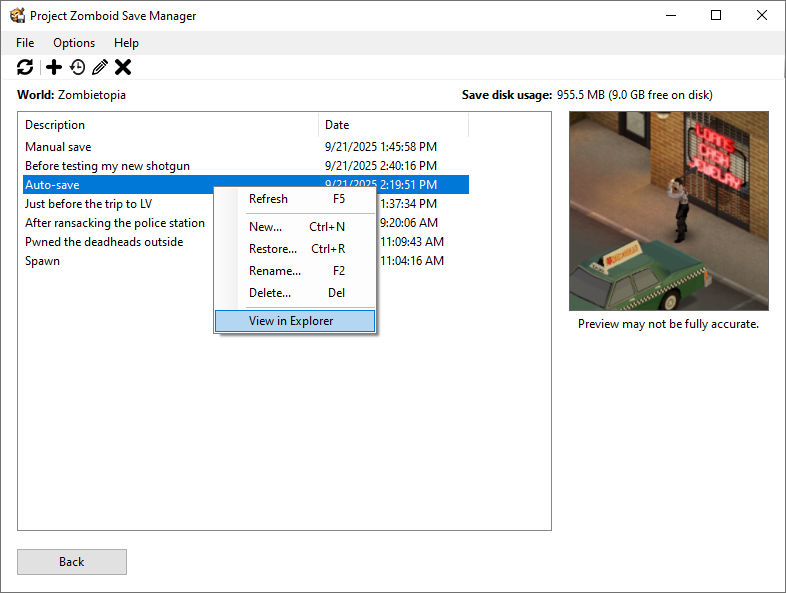

	 
	<h2 align="center">Project Zomboid Save Manager</h2>

Tired of stupid bugs (or decisions) wounding your character or ending your run? Wish there was a straightforward way to back up and restore your worlds after things go haywire? Say no more! Save Manager to the rescue!

    

You are advised to read this readme carefully. Don't sacrifice your survivor for a three-minute read!

## ✨ Features
* Simple and straightforward UI
* Manually save using the program or by pressing the save hotkey while playing (default: <kbd>Ctrl</kbd>+<kbd>F5</kbd>)
* Auto-save on a user-defined interval
* Take live previews of active worlds when saving with the manual save or auto-save functions
* Optional save compression to save disk space

## 🖥️ Supported Versions and Prerequisites
* Compatible with Project Zomboid build 41 and 42 (including latest updates).
* This application needs at least Windows 7 SP1 or above to run. Both x86 and x64 Windows OSes are supported.
* .NET 6 Desktop Runtime is required to run this application.

## ❓ Frequently Asked Questions
**Q: Is Save Manager compatible with mods? Will it work with existing worlds?**  
**A:** Indeed! Save Manager doesn't care about your mods or current world progress. It just stashes copies of your world folder and restores them when needed.

**Q: Can this application modify sandbox settings and save data?**  
**A:** Not for now. This app specializes in creating saves and restoring them, not editing save data. There are much better mod alternatives for that.

**Q: Will my worlds get rekt if I delete the app? Will my saves disappear?**  
**A:** Nope, Save Manager doesn't self-destruct. Your worlds will be left untouched. Your saves can still be found at `C:\Users\%username%\Zomboid\Backups` (or the custom directory you set before).

**Q: Why is the saving or restoration process relatively slow?**  
**A:** While Save Manager *enslaves* multiple CPU cores to speed things up, the worlds themselves have tens of thousands of tiny files, making most operations dependent on disk speed. By default, your saves are stored at `C:\Users\%username%\Zomboid\Backups`. You should override this path to your SSD drive if needed. Moreover, if you enabled save compression, turn it off unless you're low on disk space. These options can all be configured inside the application.

## 📙 Common Jargons
* **World:** Also called a *map*. Corresponds to the worlds you create in-game.
* **Save:** Also called a *checkpoint* or *backup*. A world can have multiple saves. In the [preview](#project-zomboid-save-manager) at the top of this README, **Manual save**, **Before testing my new shotgun**, etc. are called *saves*.
* **External save:** Saves manually created by the user in the Save Manager UI.
* **Manual save:** Saves created by pressing the save hotkey in-game (by default: <kbd>Ctrl</kbd>+<kbd>F5</kbd>).
* **Auto-save:** Saves created by the auto-save function. This function is disabled by default.

## ⚠️ Known Issues
Although the **manual save** and **auto-save** functions both work perfectly fine, you might sometimes experience some of the following side effects after restoring a save that was created using these functions.

#### The following side effects apply to all game versions:
* Discovered locations on the minimap might temporarily disappear. This can be fixed by simply quitting to the main menu in-game and loading the world again.
* Some nearby 'alive' and recently-killed zombies may be missing in some cases.
* Recently discovered locations may be randomized—they might spawn different zombies & vehicles, different vehicle and zone stories, etc. This mostly occurs when you drive to an undiscovered location and immediately save afterward.
* If you save while your car is running, it may be turned off after restoring the save. This behavior exists in vanilla Project Zomboid itself. Don't blame me if you save amidst a horde and your wreck doesn't start in time!

#### The following side effects *only* apply to 41.78.16 (and probably other build 41 versions):
* Your **map annotations** and discovered minimap/worldmap locations may be erased. ⚠️
* Disabled radios and TVs may sometimes be turned back on.
* Other miscellaneous issues might arise.

#### The following issues *only* apply to Save Manager itself, not related to saves:
* In the save selection page, shortcut keys like <kbd>Ctrl</kbd>+<kbd>N</kbd> and <kbd>Ctrl</kbd>+<kbd>R</kbd> may or may not work depending on how the program feels like. Use the buttons provided in the tool strip or right-click context menu instead. Only if I could find that lowlife control that's stealing key presses...

These side effects probably happen because prior to writing certain files (e.g. the minimap) to disk, the game sometimes temporarily stores them in memory, which Save Manager doesn't have access to. You are recommended to quit to the main menu in-game and create an **external save** every time you intend to save, *especially on build 41.* **This guarantees that no side effects will show up.**

Regardless, manual save and auto-save are both very reliable in build 42. The issues above are mostly just minor inconveniences.

## ⬇️ Download
Enough chit-chat. You can grab the latest version [here](./releases/latest). Make sure to install **.NET 6 Desktop Runtime** beforehand. Pick either [x86](https://aka.ms/dotnet/6.0/windowsdesktop-runtime-win-x86.exe) or [x64](https://aka.ms/dotnet/6.0/windowsdesktop-runtime-win-x64.exe) depending on your Windows version.

## 🚀 Quick Start
1. Download Save Manager and install .NET Desktop Runtime.
2. Extract `PZSaveManager.exe` anywhere you please—preferably the Desktop for ease of access.
3. Run the application and save your progress. You can also configure many save options (like save path, compression, auto-save settings, hotkeys, etc.) by navigating to **Options > Configure Save Options** in the application.
4. ???
5. PROFIT!1!!

## 💬 Feedback & Contributions
Feel free to [report bugs and request new features](https://github.com/Wirmaple73/PZSaveManager/issues). Contributions and [discussions](https://github.com/Wirmaple73/PZSaveManager/discussions) are very welcome, too. If you think Save Manager is cool, please feel free to spare a star! Happy ~save scumming~ saving!

## ©️ Credits
* [The Indie Stone](https://theindiestone.com) – Project Zomboid developer (logo modified)
* [NAudio](https://github.com/naudio/NAudio) (MIT License)
* [NHotkey](https://github.com/thomaslevesque/NHotkey) (Apache 2.0 License)
* [SharpCompress](https://github.com/adamhathcock/sharpcompress) (MIT License)
* [IcollatorForever](https://adv12.github.io/IcollatorForever/)
* [IconNinja](https://www.iconninja.com/) (Free for commercial use – see website)
* [ZapSplat](https://www.zapsplat.com/) (Free sound effects – attribution required)
* Various free resources used in the application. All attributions included where required.

> ⚠️ This application is a third-party tool and is **not affiliated with or endorsed by The Indie Stone**.
